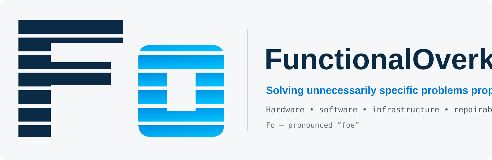

  

  <strong>FunctionalOverkill builds things for problems that are too specific, too annoying, or too poorly served by off-the-shelf answers.</strong>

---

## What Fo is

**Fo** — pronounced *foe* — is **FunctionalOverkill**.

The rule is simple: if a problem is worth solving, solve the actual problem rather than sanding off all the interesting requirements until a generic product almost fits.

That usually means some combination of:

- custom electronics and PCBs
- embedded / Android hardware
- serviceable enclosures and mechanical design
- home infrastructure and networking
- retro-modern hardware
- repairability and replaceable wear parts
- software that hides complexity instead of exporting it to the user
- documentation detailed enough that future-you does not need to reverse-engineer your own project

## The doctrine

> **Solving unnecessarily specific problems properly.**

FunctionalOverkill is not about adding features for the sake of a longer spec sheet. The *overkill* is in doing the necessary engineering thoroughly enough that the finished thing becomes simpler to own, use, repair, and understand.

A few standing rules:

- every component needs a job;
- every light communicates something or it does not exist;
- batteries should be serviceable rather than entombed in glue;
- connectors should not be structural members;
- wear-prone interfaces should be replaceable where practical;
- internal complexity is acceptable when it removes external friction;
- documentation is part of the product;
- if we call something open, you should actually be able to build it.

> **North star:** It doesn't need to look futuristic. It needs to look competent.

## Current work

### PocketDeck

**Music first. Phone optional.**

A dedicated, serviceable Android media player: local library + streaming, physical controls, removable high-capacity storage, Bluetooth/Wi-Fi/LTE, USB-C, 3.5 mm audio, a large replaceable battery, and an appliance-style UI rather than a phone pretending to be an MP3 player.

PocketDeck is currently in **private pre-EVT development**. The repository will remain private until the hardware, battery behavior, RF, software, and manufacturing package have been physically validated.

The intention — **if it reaches a production-worthy release** — is genuinely open hardware/open source: source PCB files, CAD, manufacturing data, service documentation, and Fo-developed software, subject only to third-party licensing restrictions.

### More unnecessarily specific problems

There are always more. FunctionalOverkill projects tend to live somewhere between *"nobody sells the thing I want"* and *"fine, I'll build it myself."*

## Open-source approach

Fo projects are developed in their eventual release repositories from day one, but kept private while they are unsafe, incomplete, or simply not ready for somebody else to manufacture. That keeps the engineering history, documentation, and source tree in the same place that will eventually be published.

Once a project is actually validated, the goal is to release enough source material for a competent builder to reproduce and repair it. In the ideal case, publication is an administrative change — **Private → Public** — rather than a frantic cleanup and migration exercise.

Current licensing direction for appropriate future releases:

- **CERN-OHL-S v2** for open hardware/mechanical source
- **GPLv3** or compatible copyleft licensing for Fo-developed software
- third-party material remains under its original license and redistribution terms

No vendor BSP, firmware blob, trademarked asset, or proprietary source gets magically relicensed because we would like it to be open.

## Brand

The canonical mark is the striped **Fo** monogram — uppercase **F**, lowercase **o** — and the stripes are part of the mark, not decoration to be removed when convenient.

Primary colors:

- Fo Navy `#0B2A46`
- Fo Blue `#0077D6`
- Fo Cyan `#00C7FF`
- Fo Gray `#E5E7EB`

Typography: **IBM Plex** family.

More detail lives in [`BRAND.md`](BRAND.md).

## Sign-off

> **Here. Fixed your problem. Have a laugh too.**

The less-formal workshop motto is preserved in [`BRAND.md`](BRAND.md), but the public-facing voice stays mostly professional, direct, and a little playful.
